## ISN: Large-capacity Image Steganography Based on Invertible Neural Networks (CVPR2021)

### If you want to communicate with me about the ISN, please concact me without hesitating. My email:  
 nkwangrong@mail.nankai.edu.cn 

 ### test example
 #### 1 hidden image
 the container image and the host image 

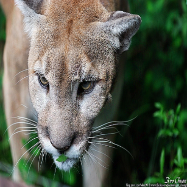 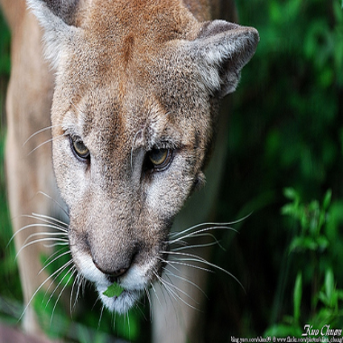

 the hidden image and the revealed  hidden image 

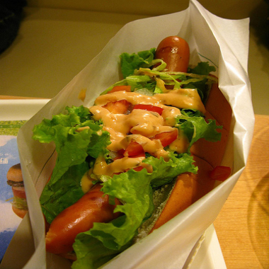 

 ####  5 hidden images
 the container image and the host image 

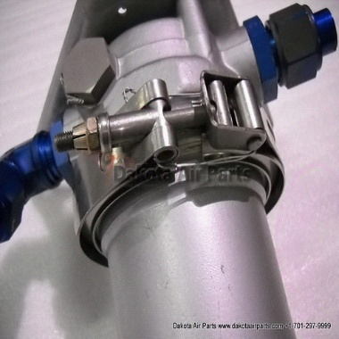 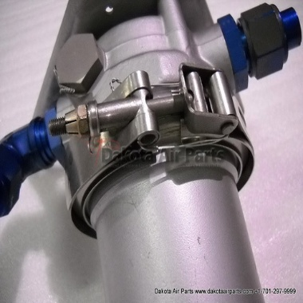

 the 5 hidden images  

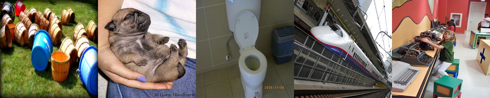 

the 5 revealed  hidden images 

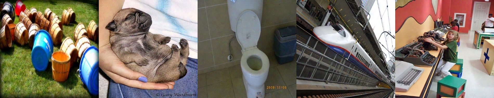

 #### You can find the results of hiding 2 ~ 3 images  in the 'doc' folder.
 
### Average PSNRs of the revealed hidden images and the container images for embedding 1∼5 images.

 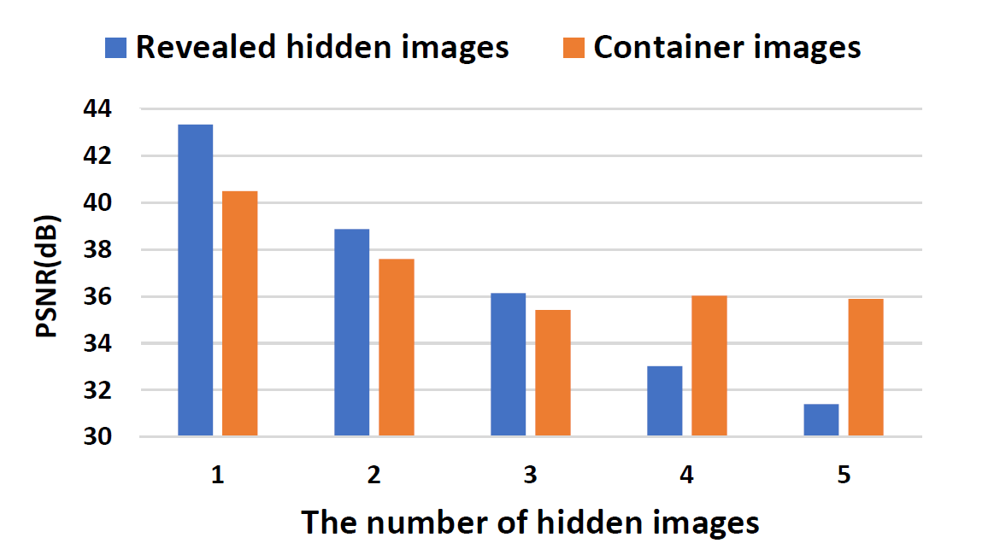

### Comparison with DeepSteg[5] 
#### [5] Shumeet Baluja. Hiding images within images. IEEE TPAMI, 2020.

Objective comparison using PSNR/SSIM. - h1 and - h2 means to hide 1 and 2 images respectively. (c) means cross-
domain testing, i.e. the model trained on another dataset is tested
directly without fine-tuning.

 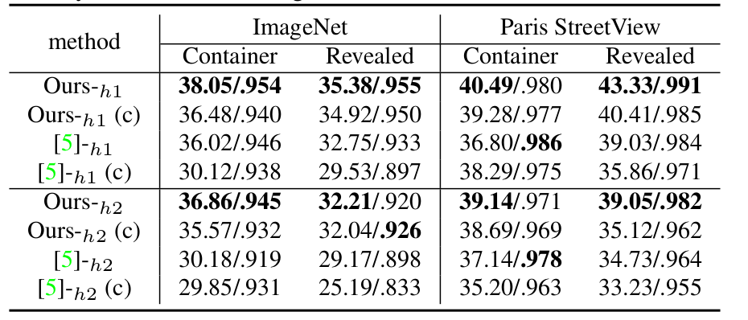
 
Visual comparisons for hiding and revealing two images.

 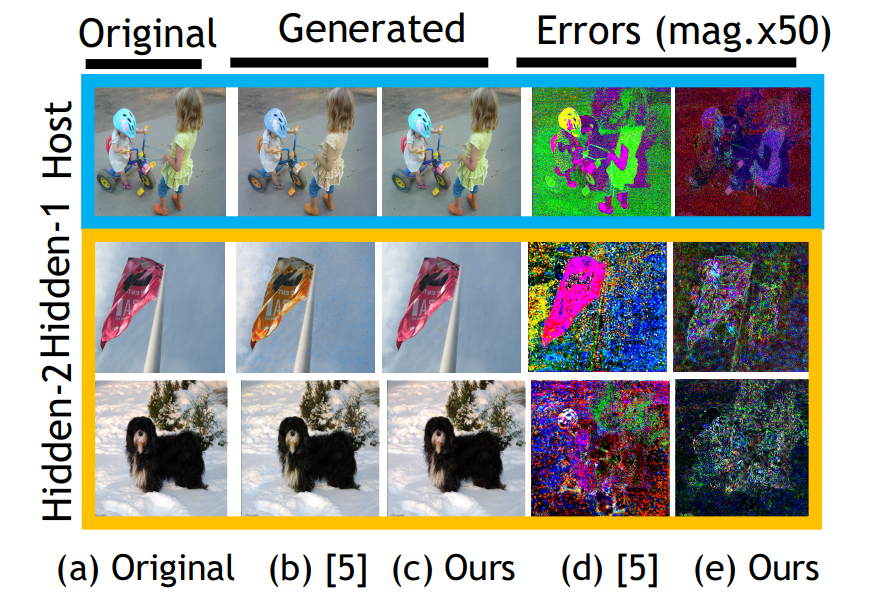

 ### Jittor 
Compared with pytorch, using Jittor can accelerate the inference speed  and reduce the memory at the same time at different resolutions. 

 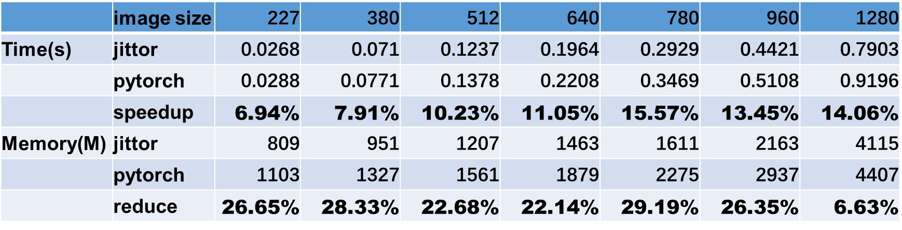

 ### Citation

If you find our work useful in your research, please consider citing:

@inproceedings{shaopingluISN2020,

  title={Large-capacity Image Steganography Based on Invertible Neural Networks},

  author={Shao-Ping Lu,  Rong Wang,  Tao Zhong,  Paul L. Rosin },

  booktitle={CVPR},

  year={2021}
  
}
